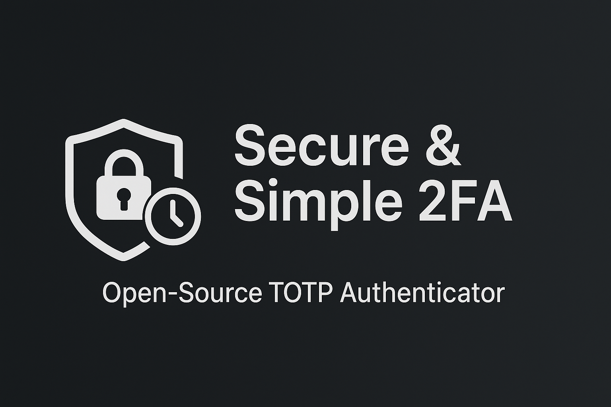

# TOTP Authenticator App

An open-source, secure, and user-friendly Time-based One-Time Password (TOTP) authenticator application built with Flutter. This app aims to provide a reliable solution for managing your 2-Factor Authentication (2FA) tokens locally on your device.

## Features

*   **Secure Storage**: Encrypts and securely stores your 2FA secrets on your device using AES encryption.
*   **QR Code Scanner**: Easily add new accounts by scanning standard TOTP QR codes with validation.
*   **Time-Based OTP Generation**: Generates accurate and timely one-time passwords with caching for performance.
*   **User-Friendly Interface**: A clean and intuitive design for seamless token management.
*   **Offline Access**: Generate OTPs even without an internet connection.
*   **Biometric Authentication**: Optional biometric login for enhanced security.
*   **Data Import/Export**: Backup and restore your accounts as JSON files.

## Architecture

The app follows a clean architecture with separation of concerns:

- **Presentation Layer**: Screens and widgets using BLoC pattern for state management.
- **Domain Layer**: Business logic in services and managers.
- **Data Layer**: Secure storage with encryption utilities.
- **Core Layer**: Shared utilities, error handling, and dependency injection.

Key components:
- `TotpBloc`: Manages TOTP item states and operations.
- `TotpManager`: Handles data persistence with encryption.
- `TotpService`: Generates TOTP codes with caching.
- `QrCodeProcessorService`: Validates and processes QR codes.
- `SettingsService`: Manages app settings.

## Security

- Secrets are encrypted using AES-256-CBC with random IVs.
- Data stored in platform secure storage (FlutterSecureStorage).
- Input sanitization for QR codes to prevent injection attacks.
- Biometric authentication for app access.
- No network requests; all operations offline.

## Getting Started

Follow these steps to get a local copy of the project up and running on your development machine.

### Prerequisites

Ensure you have the Flutter SDK installed on your system. You can find detailed installation instructions on the official Flutter website:

*   [Flutter SDK Installation Guide](https://flutter.dev/docs/get-started/install)

### Installation

1.  **Clone the repository:**
    ```bash
    git clone https://github.com/fossindia/totp.git
    cd totp
    ```
2.  **Install dependencies:**
    ```bash
    flutter pub get
    ```
3.  **Run the application:**
    ```bash
    flutter run
    ```
4.  **Run tests:**
    ```bash
    flutter test
    ```

## Testing

The project includes unit tests for core utilities and services. To ensure code quality:

- Run `flutter test` to execute all tests.
- Add tests for new features in the `test/` directory.
- Use mockito for mocking dependencies in service tests.
- Aim for high test coverage, especially for business logic and error handling.

## Contributing

Contributions are highly welcome and greatly appreciated! If you have suggestions for improvements, new features, or bug fixes, please consider contributing.

### How to Contribute

1.  **Fork the repository.**
2.  **Create your feature branch:**
    ```bash
    git checkout -b feature/YourAmazingFeature
    ```
3.  **Commit your changes:**
    ```bash
    git commit -m 'Add some AmazingFeature'
    ```
4.  **Push to the branch:**
    ```bash
    git push origin feature/YourAmazingFeature
    ```
5.  **Open a Pull Request:**
    Describe your changes and the problem they solve.

## License

This project is distributed under the MIT License. See the `LICENSE` file for more information.

## Contact

For any questions or suggestions, feel free to reach out or open an issue on the GitHub repository.

Project Link: [https://github.com/fossindia/totp](https://github.com/fossindia/totp)